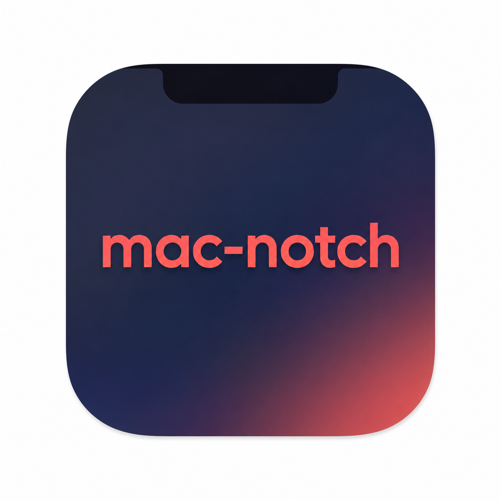

<p align="center">
  
</p>

<h1 align="center">mac-notch</h1>

<p align="center">
  A lightweight, Dynamic-Island-style hub that lives right in your MacBook notch.<br/>
  Hover the notch and it expands; move away and it collapses. No Dock icon, no menu-bar icon.
</p>

<p align="center">
  <a href="https://github.com/timryadovouu/mac-notch/actions/workflows/build.yml">
    
  </a>
  
  
  
  
</p>

---

## Overview

**mac-notch** turns the empty space around the camera notch into a small control
center. Everything is a module you can jump between from a horizontal icon rail;
the coral gear opens a proper Settings window. It's a single Swift Package
executable — pure SwiftUI + AppKit, **no third-party dependencies**.

- Runs as an **accessory app** (`LSUIElement`) — invisible in the Dock and menu bar.
- Sits over the physical notch and morphs like the iPhone Dynamic Island.
- Works on notchless Macs and external displays too (a synthetic top-center notch).

## Modules

| Module | What it does |
| --- | --- |
| ⏱ **Timer** | Pomodoro with focus presets (5 / 10 / 15 / 25 / 30 / 60 min), 4 sessions before a long break. Configurable break lengths and an optional completion sound. A live countdown shows to the right of the notch; each phase change slides a **Focus / Break** alert in from the left. |
| 📋 **Buffer** | A persistent clipboard. Everything you copy is saved as a **real file** under the buffer folder, in a per-day `YYYY-MM-DD` subfolder — text, images, and any copied files. Click an entry to copy it back, or **drag it straight out** to Finder / any app. Per-row copy & delete on hover; "Finder" opens the folder, "Clear day" wipes today. Deletions made directly in the folder show up automatically. |
| 🎵 **Media** | Now-playing + transport for **Spotify** (AppleScript) and **cmus** (`cmus-remote`). While something plays, a little **equalizer** pulses to the left of the notch. |
| ✅ **Tasks** | A local to-do list: add, complete, delete, restore. **Undone tasks stay on top, completed ones sink to the bottom.** Copy a task's text, or move it to a trash that keeps deleted items for a while. |
| ⏳ **Screen Time** | Local, on-device usage tracking: it credits the frontmost app every second and shows ranked apps (with icons), total time and switch count. **Each day is kept as its own snapshot — browse past days with ◀ / ▶.** Resets at midnight; history retention is configurable. |
| 🖥 **System** | Live CPU / RAM / storage gauges. |

The **Tasks, Buffer and Screen Time** panels have a little home-indicator grabber
at the bottom — tap it to grow the panel vertically (and again to shrink).

## The collapsed strip

Even when closed, the brow stays useful:

- **Right** — the Pomodoro countdown while a timer runs.
- **Left** — a pulsing equalizer while music plays, or a brief alert on copy / timer phase change.

## Settings

The coral **gear** toggles a standalone window:

- **Launch at login** — start automatically after a reboot.
- **Modules** — enable/disable and reorder the tabs in the rail.
- **Timer** — short/long break lengths and the completion sound.
- **Screen Time** — how long to keep daily history (default 1 year).
- **Buffer** — folder location, auto-clear age, or clear-at-end-of-day.
- **Notch** — reset-to-default-tab delay and which tab is the default.

## Install & run

Requires macOS 13+ and the Xcode command-line tools.

For development:

```bash
swift run
```

Build a double-clickable app (generates the icon, packages `mac-notch.app`):

```bash
./build-app.sh
open mac-notch.app
```

Quit from the red **Quit** button in the expanded panel.

## Where data lives

Everything stays on your Mac:

- Clipboard buffer: `~/Library/Application Support/MacNotch/localBuffer/`
- Tasks, Screen Time, settings: `~/Library/Application Support/MacNotch/`

## Permissions

- **Media → Spotify** uses AppleScript, so macOS will ask for **Automation** access
  the first time — approve it or the track/controls won't work. **cmus** needs
  `cmus-remote` on your `PATH`. Nothing else requires special permissions.

## Project structure

```
Sources/MacNotch/
  main.swift / AppDelegate.swift      app entry (accessory policy, app icon, Edit menu)
  ScreenNotch.swift                   notch geometry (+ non-notch fallback)
  NotchController.swift               the window over the notch + hover logic
  NotchRootView.swift                 the brow, its morphing & the equalizer
  ExpandedPanel.swift                 icon rail + module hosting
  GrabberBar.swift                    shared grow/shrink pill
  *Panel.swift                        per-module UI
  PomodoroModel / BufferManager /
  MediaController / AppUsageTracker /
  TodoStore / SystemStats             module logic
  Settings.swift / SettingsPanel.swift  settings model + window
Resources/AppIcon.png                 app icon source
build-app.sh                          release build → mac-notch.app
.github/workflows/build.yml           CI: build & package on push
```

## Notes

Inspired by [macnotch.io](https://macnotch.io).
